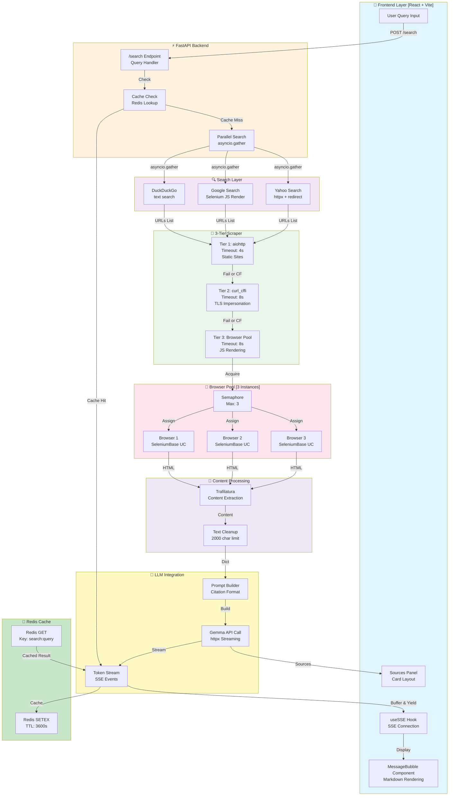

## 📊 System Architecture

### Non-Technical Overview (For Everyone)

```mermaid
flowchart LR
    Start([👤 User]) -->|Asks Question| InputBox["💬 Type Your Question"]
    
    InputBox -->|Click Search| CheckCache{{"❓ Have we<br/>answered this<br/>before?"}}
    
    CheckCache -->|Yes| UseCached["⚡ Get Answer<br/>from Memory"]
    CheckCache -->|No| MultiSearch["🔍 Search Multiple<br/>Engines<br/>Google, Bing,<br/>DuckDuckGo, Yahoo"]
    
    MultiSearch -->|Collect URLs| FetchWebsites["🌐 Fast Fetch<br/>from Websites<br/>3 Browsers<br/>Working in Parallel"]
    
    FetchWebsites -->|Extract Content| AIThinks["🧠 AI Reads Content<br/>& Writes Answer"]
    
    UseCached -->|Or| AIThinks
    
    AIThinks -->|Generate| StreamAnswer["📡 Stream Answer<br/>Word by Word"]
    
    StreamAnswer -->|Display| ChatUI["💬 Show in<br/>Chat Bubble"]
    StreamAnswer -->|Display| SourcesUI["📚 Show Sources<br/>on Right Side"]
    
    ChatUI -->|Result| End(["👤 User Sees<br/>Complete Answer<br/>with Sources"])
    SourcesUI -->|Result| End
    
    FetchWebsites -->|Save for Later| Memory["💾 Remember<br/>for Next Time"]

    style Start fill:#b3e5fc
    style InputBox fill:#81d4fa
    style CheckCache fill:#ffd54f
    style UseCached fill:#a5d6a7
    style MultiSearch fill:#ce93d8
    style FetchWebsites fill:#ffab91
    style AIThinks fill:#fff59d
    style StreamAnswer fill:#b2dfdb
    style ChatUI fill:#c5e1a5
    style SourcesUI fill:#f8bbd0
    style End fill:#a1887f
    style Memory fill:#c8e6c9
```

**User Journey Summary:**
1. **You ask** a question in the web interface
2. **System checks** if we've answered this before (instant if cached)
3. **Multiple searches** happen simultaneously across Google, Bing, DuckDuckGo, Yahoo
4. **Fast fetching** from top results using 3 parallel browsers
5. **AI processes** all content and generates comprehensive answer
6. **Stream displays** word-by-word with sources visible on the right
7. **Results cached** for future queries

---

### Technical Deep Dive (For Developers)

**Component Breakdown:**
- **Frontend**: React + Vite SPA with real-time SSE streaming and markdown support
- **Backend**: FastAPI async endpoints with concurrent search and scraping
- **Search Layer**: Multi-engine queries (Google/Bing/DDG/Yahoo) with JS rendering
- **Scraper Tiers**: 3-layer fallback (aiohttp → curl_cffi → BrowserPool) for reliability
- **Browser Pool**: 3 semaphore-controlled parallel browsers for speed
- **Content Processing**: Trafilatura extraction + text normalization
- **LLM Integration**: Gemma streaming API with token-by-token SSE response
- **Caching**: Redis with 1-hour TTL for performance optimization

---