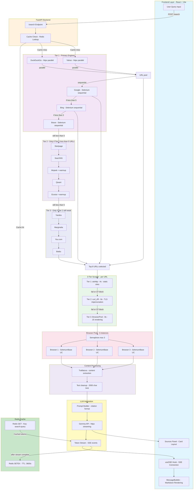
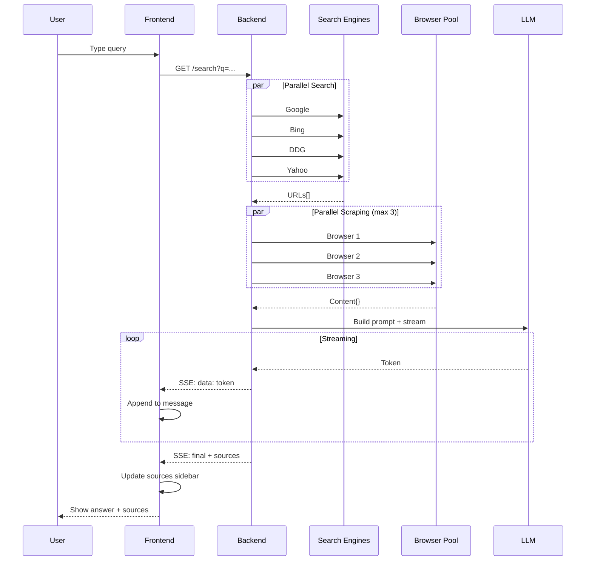

# 🤖 Agentic Research Assistant

An intelligent AI-powered research assistant that aggregates information from **20 search engines** across 4 tiers, scrapes web content with a self-healing browser pool, and provides comprehensive answers with cited sources. Features a modern Google AI Mode-inspired interface.

[](https://python.org)
[](https://fastapi.tiangolo.com)
[](https://reactjs.org)
[](LICENSE)

---

## 🌟 Features

- **20 Search Engines (4 Tiers)**: Google, Bing, DDG, Yahoo, Brave, Startpage, SearXNG, Mojeek, Qwant, Ecosia, Yandex, Marginalia, You.com, Swisscows, Baidu, Stract, Presearch, Metager, LibreX, Whoogle
- **Smart Tiered Strategy**: Tier 1 (Selenium) → Tier 2 (Meta-search) → Tier 3 (Global) → Tier 4 (Niche)
- **Selenium Auto-Recovery**: Health monitoring with automatic driver restart on failures
- **Sequential Selenium**: Prevents deadlock by running shared-driver engines sequentially
- **HTTP Session Warmup**: Browser-like headers + homepage warmup to bypass 403 blocks
- **LLM Continuation**: Auto-continues partial responses on connection drops (no duplication)
- **Parallel Browser Pool**: 3 concurrent browser instances for ultra-fast scraping
- **3-Tier Scraping**: aiohttp → curl_cffi → Selenium (layered fallback)
- **Real-time Streaming**: SSE-based response streaming for instant feedback
- **Google AI Mode UI**: Clean, modern interface with right-side sources panel
- **Redis Caching**: Result caching for faster repeat queries
- **Full Markdown Support**: Headings, lists, bold/italic, citations

---

## 📁 Project Structure

```
Agentic_research_assistant/
├── main.py              # FastAPI backend + LLM integration
├── scraper.py           # URL scraping with 3-layer fallback
├── selenium_scraper.py  # Browser pool + UniversalScraper
├── run.py              # Entry point
├── requirements.txt    # Python dependencies
├── .env.example        # Environment template
│
└── frontend/           # React + Vite frontend
    ├── src/
    │   ├── App.jsx           # Main chat + sources sidebar
    │   ├── App.css           # Layout styling
    │   ├── components/
    │   │   ├── MessageBubble.jsx    # Chat messages + markdown
    │   │   └── ...
    │   └── hooks/
    │       └── useSSE.js      # Server-Sent Events hook
    ├── package.json
    └── vite.config.js
```

---

## 🚀 Quick Start

### Prerequisites
- Python 3.9+
- Node.js 18+
- Redis (optional, for caching)

### 1. Clone & Setup
```bash
git clone https://github.com/muhammad-umer8132/Agentic_research_assistant.git
cd Agentic_research_assistant
```

### 2. Backend Setup
```bash
# Create virtual environment
python -m venv venv
source venv/bin/activate  # Windows: venv\Scripts\activate

# Install dependencies
pip install -r requirements.txt

# Configure environment
cp .env.example .env
# Edit .env with your LLM_BASE_URL and LLM_MODEL
```

### 3. Frontend Setup
```bash
cd frontend
npm install
npm run build
cd ..
```

### 4. Run
```bash
python run.py
```

Access at: `http://localhost:8001`

---

## ⚙️ Environment Variables

```env
LLM_BASE_URL=http://localhost:1234/v1  # Your LLM API endpoint
LLM_MODEL=meta-llama-3.1-8b-instruct   # Model name
REDIS_URL=redis://localhost:6379       # Optional: Redis caching
```

---

## 📊 System Architecture

### Non-Technical Overview (For Everyone)

```mermaid
flowchart LR
    Start([User]) -->|Asks question| InputBox["Type your question"]
    InputBox -->|Click search| CheckCache{"Answered before?"}

    CheckCache -->|Yes - instant!| StreamAnswer["Stream answer word by word"]
    CheckCache -->|No| Tier1["Tier 1 - Google, DDG, Yahoo, Bing, Brave"]

    Tier1 -->|5+ URLs found| FetchWebsites["Smart scraping\n3 browsers + auto-recovery"]
    Tier1 -->|Less than 5 URLs| Tier2["Tier 2 - Startpage, SearXNG, Mojeek"]
    Tier2 -->|5+ URLs found| FetchWebsites
    Tier2 -->|Still weak| Tier3["Tier 3 - Yandex, Baidu, You.com"]
    Tier3 -->|Any URLs| FetchWebsites

    FetchWebsites -->|Extract content| AIThinks["AI reads content and writes answer"]
    AIThinks -->|Generate| StreamAnswer

    StreamAnswer -->|Display| ChatUI["Show in chat bubble"]
    StreamAnswer -->|Display| SourcesUI["Show sources on right side"]
    StreamAnswer -->|Save after done| Memory["Remember for next time"]

    ChatUI --> End(["User sees complete answer with sources"])
    SourcesUI --> End

    style Start fill:#b3e5fc
    style InputBox fill:#81d4fa
    style CheckCache fill:#ffd54f
    style Tier1 fill:#ce93d8
    style Tier2 fill:#ba68c8
    style Tier3 fill:#ab47bc
    style FetchWebsites fill:#ffab91
    style AIThinks fill:#fff59d
    style StreamAnswer fill:#b2dfdb
    style ChatUI fill:#c5e1a5
    style SourcesUI fill:#f8bbd0
    style Memory fill:#c8e6c9
    style End fill:#a1887f
```



**How it works (Simple):**
1. **You ask** a question in the web interface
2. **20 Search Engines**: 4-tier cascade — Tier 1 → Tier 2 → Tier 3 → Tier 4
3. **We scrape** using 3 browsers with auto-recovery and health monitoring
4. **AI reads** all the content and writes a comprehensive answer
5. **You see** the response appear word-by-word, with sources on the right

---

### Technical Deep Dive



---

## 🔧 Core Components

### 1. BrowserPool (Parallel Scraping)
```python
class BrowserPool:
    def __init__(self, size=3):
        self._pool = [BrowserSession() for _ in range(3)]
        self._semaphore = threading.Semaphore(3)
    
    def fetch_html(self, url, timeout_s=8.0):
        session = self._acquire()  # Blocking acquire
        try:
            return session.fetch_page_fast(url, timeout_s)
        finally:
            self._release(session)
```

**Why it matters**: Instead of sequential scraping (15 URLs × 5s = 75s), we scrape 3 URLs simultaneously (~25s total).

### 2. 4-Tier Search Strategy
| Tier | Engines | Count | Purpose |
|------|---------|-------|---------|
| 1 | Google, Bing, Brave (Selenium) + DDG, Yahoo (HTTP) | 5 | Primary sources |
| 2 | Startpage, SearXNG, Mojeek, Qwant, Ecosia | 5 | Meta-search & privacy |
| 3 | Yandex, Marginalia, You.com, Swisscows, Baidu | 5 | Global & independent |
| 4 | Stract, Presearch, Metager, LibreX, Whoogle | 5 | Niche & open-source |

### 3. 3-Tier Scraping Strategy
| Tier | Method | Timeout | Use Case |
|------|--------|---------|----------|
| 1 | aiohttp | 4s | Static sites, no JS |
| 2 | curl_cffi | 8s | TLS fingerprint bypass |
| 3 | BrowserPool | 8s | JS-rendered, CF-protected |

### 4. Selenium Auto-Recovery
```python
# Health monitoring with automatic restart
_selenium_failures = 0
_SELENIUM_MAX_FAILURES = 3

async def restart_selenium_if_needed():
    if _selenium_failures >= 3:
        close_selenium()
        await asyncio.sleep(1)
        init_selenium()  # Fresh start
```

### 5. HTTP Session Warmup (403 Bypass)
```python
def get_realistic_headers(referer: str = None) -> dict:
    return {
        "User-Agent": "Mozilla/5.0...Chrome/124...",
        "Sec-Ch-Ua": '"Chromium";v="124"...',
        "Sec-Fetch-Site": "none" if not referer else "same-origin",
        # ... full browser headers
    }

# Mojeek/Ecosia: warmup + 0.5s delay
await client.get("https://www.mojeek.com/", headers=get_realistic_headers())
await asyncio.sleep(0.5)
```

### 6. LLM Continuation (No Duplication)
```python
accumulated_content = ""  # Track partial response

# On RemoteProtocolError:
current_prompt = f"""Continue from EXACTLY where you left off.
Do NOT repeat anything already written.

{accumulated_content}"""
# Retry with continuation prompt → yields NEW tokens only
```

### 7. Fast Fetch (`fetch_page_fast`)
- Uses `driver.get()` directly (not `uc_open_with_reconnect`)
- Hard timeout via `set_page_load_timeout()`
- Accepts partial HTML (≥500 chars)
- Quick CF detection with 2s grace period

---

## 📈 Performance Optimizations

| Optimization | Before | After |
|-------------|--------|-------|
| Browser Pool | 1 browser, sequential | 3 browsers, parallel |
| Page Load | uc_open (slow) | driver.get + timeout |
| Search Engines | 5 engines | **20 engines (4 tiers)** |
| Selenium Health | No monitoring | **Auto-recovery on 3 failures** |
| HTTP 403 Blocks | Basic headers | **Session warmup + realistic headers** |
| LLM Errors | Stop on error | **Continue from partial (no dup)** |
| Selenium Execution | Parallel (deadlock risk) | **Sequential (shared driver safe)** |
| Max URLs | 15 | 8 (quality > quantity) |
| Concurrency | 5 | 10 |

---

## 🎨 Frontend Features

### Right-Side Sources Panel (Google AI Mode Style)
- **Card-based layout**: Clean, minimal cards with domain favicons
- **Favicon generation**: First letter of domain as colored icon
- **Hover effects**: Subtle background highlight
- **Sticky header**: Source count with clean typography
- **Responsive**: Hides on mobile (<900px)
- **Smooth animations**: Slide-in with fade effects

### Markdown Support
```javascript
// Supports # through #### headings
/^#{1,4}\s+/ → <h1> to <h4>

// Supports **bold**, *italic*
/\*\*(.+?)\*\*/ → <strong>
/(?<!\*)\*(?!\*)(.+?)(?<!\*)\*(?!\*)/ → <em>

// Lists (ordered/unordered)
/^\d+\.\s+/ → <ol>
/^[*\-+]]\s+/ → <ul>
```

---

## 🔄 Data Flow



---

## 🛠️ Troubleshooting

| Issue | Solution |
|-------|----------|
| LLM timeout / connection drop | **Auto-continuation** — resumes from partial response |
| Browser pool fail | **Auto-recovery** — restarts after 3 consecutive failures |
| Selenium deadlock | **Sequential execution** — Google → Bing → Brave (no parallel) |
| No sources | Check `MAX_RETRIES=1` in selenium_scraper.py |
| CF blocks / 403 errors | **Session warmup** — homepage visit + realistic headers |
| LLM partial response | Already handled — continues without duplication |

---

## 📚 Tech Stack

| Layer | Technology |
|-------|-----------|
| Backend | FastAPI, asyncio, httpx, aiohttp, BeautifulSoup |
| Scraping | SeleniumBase, curl_cffi, trafilatura |
| Frontend | React 18, Vite, CSS3 (Google AI Mode design) |
| Search | 20 engines across 4 tiers |
| Cache | Redis (optional) |
| LLM | OpenAI-compatible API with continuation support |

---

## 🤝 Contributing

1. Fork the repository
2. Create your feature branch (`git checkout -b feature/amazing`)
3. Commit changes (`git commit -m 'Add amazing feature'`)
4. Push to branch (`git push origin feature/amazing`)
5. Open a Pull Request

---

## 📝 License

MIT License - feel free to use for personal or commercial projects.

---

## 🙏 Acknowledgments

- [SeleniumBase](https://seleniumbase.io/) for undetected Chrome automation
- [curl_cffi](https://github.com/yifeikong/curl_cffi) for TLS impersonation
- [trafilatura](https://trafilatura.readthedocs.io/) for content extraction
- [FastAPI](https://fastapi.tiangolo.com/) for the backend framework

---

**Made with ❤️ by [Muhammad Umer](https://www.linkedin.com/in/muhammad-umer-154605173/)**
