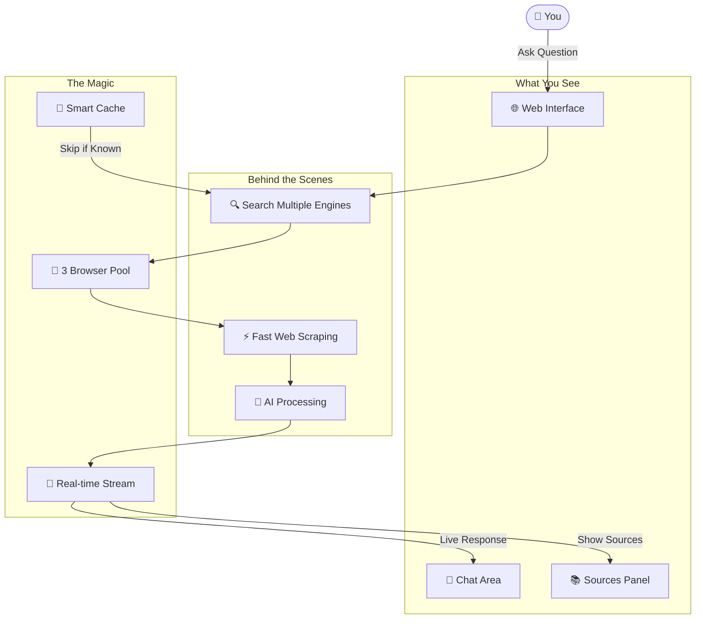
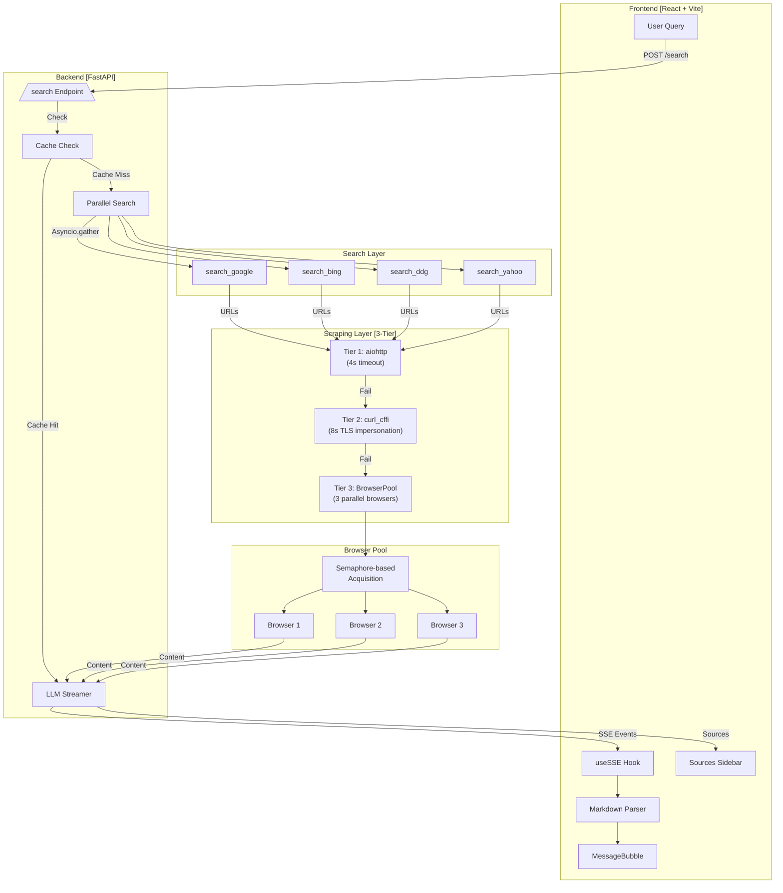
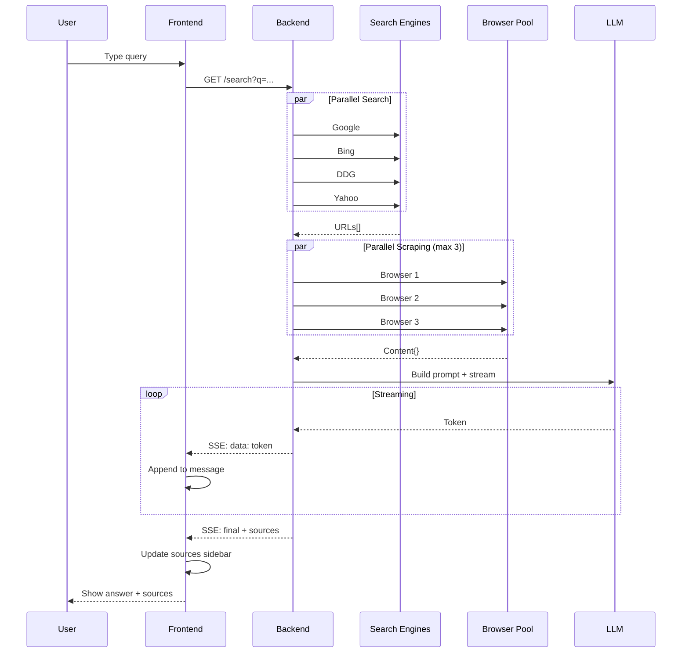

# 🤖 Agentic Research Assistant

An intelligent AI-powered research assistant that aggregates information from multiple search engines, scrapes web content in parallel using a browser pool, and provides comprehensive answers with cited sources.

[](https://python.org)
[](https://fastapi.tiangolo.com)
[](https://reactjs.org)
[](LICENSE)

---

## 🌟 Features

- **Multi-Engine Search**: Queries Google, Bing, DuckDuckGo, Yahoo simultaneously
- **Parallel Browser Pool**: 3 concurrent browser instances for ultra-fast scraping
- **Smart Fallback Strategy**: aiohttp → curl_cffi → Selenium (layered approach)
- **Real-time Streaming**: SSE-based response streaming for instant feedback
- **Right-Side Sources Panel**: Card-based source display in a knowledge panel layout
- **Redis Caching**: Result caching for faster repeat queries
- **Markdown Rendering**: Full markdown support with headings, lists, bold/italic

---

## 📁 Project Structure

```
Agentic_research_assistant/
├── main.py              # FastAPI backend + LLM integration
├── scraper.py           # URL scraping with 3-layer fallback
├── selenium_scraper.py  # Browser pool + UniversalScraper
├── run.py              # Entry point
├── requirements.txt    # Python dependencies
├── .env.example        # Environment template
│
└── frontend/           # React + Vite frontend
    ├── src/
    │   ├── App.jsx           # Main chat + sources sidebar
    │   ├── App.css           # Layout styling
    │   ├── components/
    │   │   ├── MessageBubble.jsx    # Chat messages + markdown
    │   │   └── ...
    │   └── hooks/
    │       └── useSSE.js      # Server-Sent Events hook
    ├── package.json
    └── vite.config.js
```

---

## 🚀 Quick Start

### Prerequisites
- Python 3.9+
- Node.js 18+
- Redis (optional, for caching)

### 1. Clone & Setup
```bash
git clone https://github.com/muhammad-umer8132/Agentic_research_assistant.git
cd Agentic_research_assistant
```

### 2. Backend Setup
```bash
# Create virtual environment
python -m venv venv
source venv/bin/activate  # Windows: venv\Scripts\activate

# Install dependencies
pip install -r requirements.txt

# Configure environment
cp .env.example .env
# Edit .env with your LLM_BASE_URL and LLM_MODEL
```

### 3. Frontend Setup
```bash
cd frontend
npm install
npm run build
cd ..
```

### 4. Run
```bash
python run.py
```

Access at: `http://localhost:8001`

---

## ⚙️ Environment Variables

```env
LLM_BASE_URL=http://localhost:1234/v1  # Your LLM API endpoint
LLM_MODEL=meta-llama-3.1-8b-instruct   # Model name
REDIS_URL=redis://localhost:6379       # Optional: Redis caching
```

---

## 📊 System Architecture

### Non-Technical Overview (For Everyone)



**How it works (Simple):**
1. **You ask** a question in the web interface
2. **We search** Google, Bing, DuckDuckGo, Yahoo at the same time
3. **We scrape** the top websites using 3 browsers working together
4. **AI reads** all the content and writes a comprehensive answer
5. **You see** the response appear word-by-word, with sources on the right

---

### Technical Deep Dive



---

## 🔧 Core Components

### 1. BrowserPool (Parallel Scraping)
```python
class BrowserPool:
    def __init__(self, size=3):
        self._pool = [BrowserSession() for _ in range(3)]
        self._semaphore = threading.Semaphore(3)
    
    def fetch_html(self, url, timeout_s=8.0):
        session = self._acquire()  # Blocking acquire
        try:
            return session.fetch_page_fast(url, timeout_s)
        finally:
            self._release(session)
```

**Why it matters**: Instead of sequential scraping (15 URLs × 5s = 75s), we scrape 3 URLs simultaneously (~25s total).

### 2. 3-Tier Scraping Strategy
| Tier | Method | Timeout | Use Case |
|------|--------|---------|----------|
| 1 | aiohttp | 4s | Static sites, no JS |
| 2 | curl_cffi | 8s | TLS fingerprint bypass |
| 3 | BrowserPool | 8s | JS-rendered, CF-protected |

### 3. Fast Fetch (`fetch_page_fast`)
- Uses `driver.get()` directly (not `uc_open_with_reconnect`)
- Hard timeout via `set_page_load_timeout()`
- Accepts partial HTML (≥500 chars)
- Quick CF detection with 2s grace period

---

## 📈 Performance Optimizations

| Optimization | Before | After |
|-------------|--------|-------|
| Browser Pool | 1 browser, sequential | 3 browsers, parallel |
| Page Load | uc_open (slow) | driver.get + timeout |
| Search Engines | 5 engines | 3 engines (removed Bing/Brave) |
| Max URLs | 15 | 8 (quality > quantity) |
| Concurrency | 5 | 10 |

---

## 🎨 Frontend Features

### Right-Side Sources Panel
- **Card-based layout**: Each source as a clickable card
- **Favicon generation**: First letter of domain as icon
- **Hover effects**: Gradient accent bar on hover
- **Sticky header**: Shows source count
- **Responsive**: Hides on mobile (<900px)

### Markdown Support
```javascript
// Supports # through #### headings
/^#{1,4}\s+/ → <h1> to <h4>

// Supports **bold**, *italic*
/\*\*(.+?)\*\*/ → <strong>
/(?<!\*)\*(?!\*)(.+?)(?<!\*)\*(?!\*)/ → <em>

// Lists (ordered/unordered)
/^\d+\.\s+/ → <ol>
/^[*\-+]]\s+/ → <ul>
```

---

## 🔄 Data Flow



---

## 🛠️ Troubleshooting

| Issue | Solution |
|-------|----------|
| LLM timeout | Increase timeout in `ask_llm()` (default: 300s) |
| Browser pool fail | Check Chrome/Chromium installed |
| No sources | Check `MAX_RETRIES=1` in selenium_scraper.py |
| CF blocks | curl_cffi tier handles most; pool is fallback |

---

## 📚 Tech Stack

| Layer | Technology |
|-------|-----------|
| Backend | FastAPI, asyncio, httpx, aiohttp |
| Scraping | SeleniumBase, curl_cffi, BeautifulSoup |
| Frontend | React 18, Vite, CSS3 |
| Cache | Redis (optional) |
| LLM | OpenAI-compatible API (LM Studio, etc.) |

---

## 🤝 Contributing

1. Fork the repository
2. Create your feature branch (`git checkout -b feature/amazing`)
3. Commit changes (`git commit -m 'Add amazing feature'`)
4. Push to branch (`git push origin feature/amazing`)
5. Open a Pull Request

---

## 📝 License

MIT License - feel free to use for personal or commercial projects.

---

## 🙏 Acknowledgments

- [SeleniumBase](https://seleniumbase.io/) for undetected Chrome automation
- [curl_cffi](https://github.com/yifeikong/curl_cffi) for TLS impersonation
- [trafilatura](https://trafilatura.readthedocs.io/) for content extraction
- [FastAPI](https://fastapi.tiangolo.com/) for the backend framework

---

**Made with ❤️ by Muhammad Umer**
